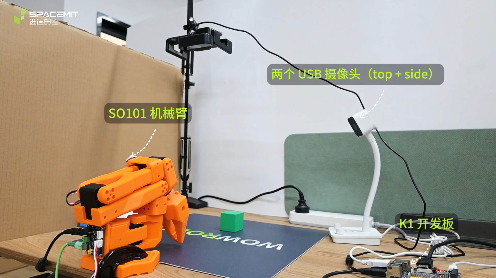
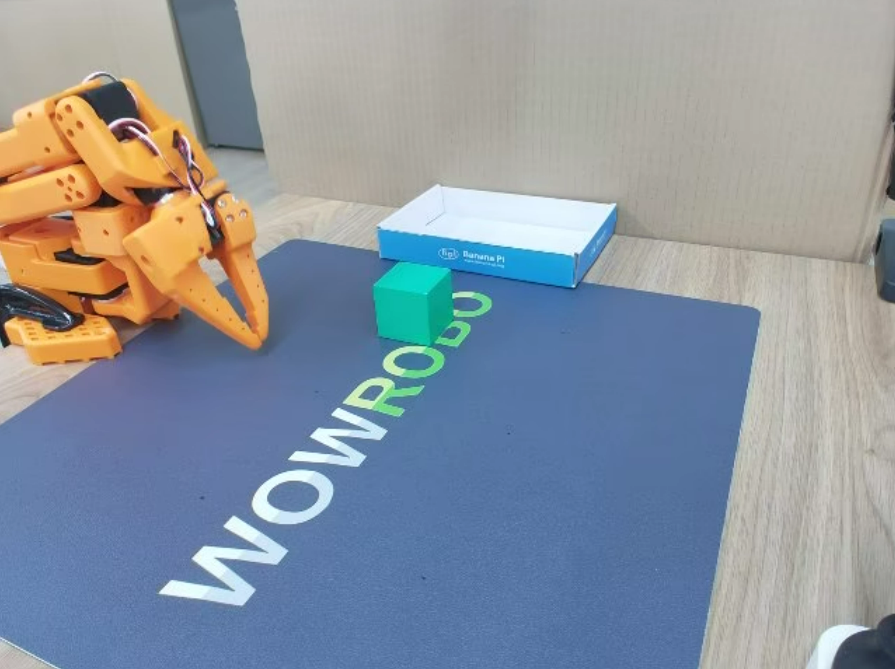

# LeRobot User Guide

This document describes how to use **LeRobot** on the **K1/K3** platform. It provides a complete, end-to-end (E2E) workflow for running robotic arm applications on K1, including:

- Calibration, teleoperation, and data collection for the **SO-101 dual-arm robot** (leader + follower)
- Training an **ACT (Action Chunking Transformer)** model on a GPU server and deploying it to K1/K3 for local inference to perform a cube pick-and-place task
- Fine-tuning a **SmolVLA** model on a GPU server and deploying it in a distributed setup to complete the same task

## Hardware and Software Requirements

### Hardware

The following hardware is required:

- **Training platform**: A server equipped with an RTX-class GPU or better
- **Data collection platform (optional)**: A PC
- **Local environment**: K1/K3 development board + Bianbu firmware
- **Robotic arm**: SO-101 leader–follower robotic arm
- **Visual input**: Two USB cameras

## Software Environment Setup

> [!NOTE]
>
> This guide requires two or more environments: one training environment mainly used for model training; one data collection environment, which can also be set up on the development board, but data collection on a PC is strongly recommended for smoother performance, especially for visualized data collection; and one local environment on the development board, mainly used for model deployment and inference. The software environment must be installed on all platforms. Unless otherwise specified, commands are executed on the development board.

### Download the Source Code

```bash
git clone -b v0.5.0 https://github.com/huggingface/lerobot.git
```

### Install System Dependencies

Update the system and install required packages:

```bash
sudo apt update
sudo apt install python3-venv ffmpeg
```

- **python3-venv**: Used to manage pip virtual environments
- **ffmpeg**: Required for video frame processing

### pyenv Installation and Usage

K1 uses Bianbu v2+ firmware with Python 3.12, while K3 uses Bianbu v3+ firmware with Python 3.14. However, since Spacemit PyTorch currently supports only Python 3.12 and Python 3.14, it is recommended to use pyenv to create a Python 3.12/3.13 virtual environment when using LeRobot on K3. The following example uses Python 3.13 to demonstrate pyenv installation and usage.

1. **Install pyenv**

```bash
git clone https://github.com/pyenv/pyenv.git ~/.pyenv
```

2. **Configure the shell environment**

```bash
echo 'export PYENV_ROOT="$HOME/.pyenv"' >> ~/.bashrc
echo 'command -v pyenv >/dev/null || export PATH="$PYENV_ROOT/bin:$PATH"' >> ~/.bashrc
echo 'eval "$(pyenv init -)"' >> ~/.bashrc
source ~/.bashrc
```

3. **Install Python 3.13**

```bash
pyenv install 3.13
```

After installation, run `pyenv versions` to check whether the installed Python version appears:

```bash
➜  ~ pyenv versions
* system (set by /home/zq/.pyenv/version)
   3.13.12
```

4. **Set the local Python version**

Enter the LeRobot project directory and run `pyenv local`. pyenv will generate a file named `.python-version` in that directory to specify the Python version used there.

```bash
pyenv local 3.13.12
```

After setting it, run `python3 -V` to verify that the version is Python 3.13.

### Install Python Dependencies

```bash
cd ~/lerobot
python3 -m venv ~/.lerobot-venv
source ~/.lerobot-venv/bin/activate
pip install -e . && pip install "lerobot[feetech]"
```

## Pre-Deployment Setup

### Robotic Arm Calibration

1. Before calibration, ensure the robot is fully assembled and motors are configured with:

   - [SO-101 assembly guide](https://huggingface.co/docs/lerobot/so101#step-by-step-assembly-instructions)
   - [Motor configuration](https://huggingface.co/docs/lerobot/so101#configure-the-motors)

   Then, Connect both arms (power + USB) and run:

   ```bash
   lerobot-find-port
   ```

2. Grant serial port permission
  
   USB UART devices typically appear as `/dev/ttyACM*` on K1:

   ```Bash
   sudo chmod 666 /dev/ttyACM0
   ```

3. Calibrate each arm

   ```Bash
   # Follower arm
    lerobot-calibrate \
    --robot.type=so101_follower \
    --robot.port=/dev/ttyACM0 \
   --robot.id=my_awesome_follower_arm # custom ID
   
   # Leader arm
    lerobot-calibrate \
    --teleop.type=so101_leader \
    --teleop.port=/dev/ttyACM1 \
   --teleop.id=my_awesome_leader_arm # custom ID
   ```

   **Note:** Make sure the device names match those on your system. For the detailed procedure, refer to the [Hugging Face official calibration guide](https://huggingface.co/docs/lerobot/so101#calibration-video) for details.

### Teleoperation

1. **Verify Robot Ports**

   Before starting teleoperation or data collection, verify the robotic arm’s serial port using the command below.

   ```Bash
   lerobot-find-port
   ```

2. **Teleoperation Without Cameras**

   Once the serial ports are correctly configured, run the following command to start teleoperation without cameras.

   ```Bash
   lerobot-teleoperate \
    --robot.type=so101_follower \
    --robot.port=/dev/ttyACM0 \
    --robot.id=my_awesome_follower_arm \
    --teleop.type=so101_leader \
    --teleop.port=/dev/ttyACM1 \
    --teleop.id=my_awesome_leader_arm
   ```

3. **Camera confirmation**

   The author used two USB cameras. One is fixed above the workspace (`top`) to provide a global view, while the other is fixed on the side (`side`) to obtain a more detailed operational view. A third-person view of the camera layout is shown below. 

   The principle of camera placement is to ensure that the cameras can capture key details during task execution while avoiding unrelated objects in the frame, thereby ensuring high dataset quality and accuracy. The `top` and `side` views are shown below:

   

   

   After fixing the camera viewpoints, connect both USB cameras to the development board and run the following command to check the camera IDs:

   ```bash
   lerobot-find-cameras opencv
   ```

   Example output from terminal:

   ```Bash
   --- Detected Cameras ---
   Camera #0:
    Name: OpenCV Camera @ /dev/video2
    Type: OpenCV
    Id: /dev/video20
    Backend api: V4L2
    Default stream profile:
      Format: 0.0
      Width: 640
      Height: 480
      Fps: 30.0
   --------------------
   Camera #1:
    Name: OpenCV Camera @ /dev/video4
    Type: OpenCV
    Id: /dev/video22
    Backend api: V4L2
    Default stream profile:
      Format: 0.0
      Width: 640
      Height: 480
      Fps: 30.0
   --------------------

   Finalizing image saving...
   Image capture finished. Images saved to outputs/captured_images
   ```

   Locate the images captured by each camera in the `outputs/capture_images` directory, and verify the port ID corresponding to each camera position.

4. **Visualized Teleoperation**

   After confirming camera IDs, run the following command to verify camera quality and framing.

   ```Bash
   lerobot-teleoperate \
    --robot.type=so101_follower \
    --robot.port=/dev/ttyACM0 \
    --robot.id=my_awesome_follower_arm \
    --robot.cameras="{
        top:  {type: opencv, index_or_path: 2, width: 640, height: 480, fps: 30},
        side: {type: opencv, index_or_path: 4, width: 640, height: 480, fps: 30}
    }" \
    --teleop.type=so101_leader \
    --teleop.port=/dev/ttyACM1 \
    --teleop.id=my_awesome_leader_arm \
    --display_data=true
   ```

### Dataset Collection

> [!TIP]
>
> You can also collect datasets locally on the development board, but for smoother performance, data collection on a PC is recommended. If you collect data on a PC, you need to complete robotic arm calibration and teleoperation testing on the PC first.

1. Before starting data collection, you may choose whether to log in to `huggingface-cli`.
   Logging in allows you to conveniently upload datasets and models to the Hugging Face Hub.

   ```Bash
   hf auth login
   ```

   Follow the prompts to enter your Hugging Face access token.

2. After logging in, you can obtain and set `<HF_USER>` as follows:

   ```Bash
   HF_USER=$(hf auth whoami | head -n 1 | awk '{print $3}')
   echo $HF_USER
   ```

   If `<HF_USER>` is not specified, you must manually replace `<HF_USER>` in the following content with an arbitrary name.

3. Start the data collection

   Run the following command to begin data collection:

   ```Bash
   lerobot-record \
    --robot.type=so101_follower \
    --robot.port=/dev/ttyACM0 \
    --robot.id=my_awesome_follower_arm \
    --robot.cameras="{
        top:  {type: opencv, index_or_path: 2, width: 640, height: 480, fps: 30},
        side: {type: opencv, index_or_path: 4, width: 640, height: 480, fps: 30}
    }" \
    --teleop.type=so101_leader \
    --teleop.port=/dev/ttyACM1 \
    --teleop.id=my_awesome_leader_arm \
    --dataset.num_episodes=60 \
    --dataset.episode_time_s=30 \
    --dataset.reset_time_s=30 \
    --dataset.repo_id=${HF_USER}/record-green-cube \
    --dataset.single_task="Place the green cube into the box" \
    --dataset.root=./datasets/record-green-cube \
    --dataset.push_to_hub=True \
    --play_sounds=false \
    --display_data=true # This is recommended on the x86 workstation
   ```

   - **Parameter Descriptions**

     - `dataset.num_episodes`: Specifies the expected number of data episodes to be collected
     - `dataset.episode_time_s`: Specifies the duration of each data collection episode (in seconds)
     - `dataset.reset_time_s`: Preparation time between consecutive data collection episodes (in seconds)
     - `dataset.repo_id`:
       - `$HF_USER`: the current user
       - `record-green-cube`: the dataset name
     - `dataset.single_task`: Task instruction, which can be used as input for VLA models
     - `dataset.root`: Specifies the dataset storage location; defaults to `~/.cache/huggingface/lerobot/`
     - `dataset.push_to_hub`: Determines whether to upload the dataset to the Hugging Face Hub
     - `play_sounds`：Enables or disables instruction audio playback
     - `display_data`：Enables or disables the graphical interface. **If enabled, data collection is recommended on an x86 server**

     For detailed command usage, run the command with `--help`.

- **Checkpointing and Recovery**
  - Checkpoints are created automatically during recording
  - Resume recording with `--resume=true` for any issues
  - To restart from scratch, **manually delete** the dataset directory

- **Keyboard controls during recording (X11 mode only)**
  - Press **Right Arrow (**`→`**)**: End the current episode early, or reset the timer and move to the next episode
  - Press **Left Arrow (**`←`**)**: Discard the current episode and re-record it
  - Press **Esc (**`ESC`**)**: Immediately stop the session, encode the videos, and upload the dataset

- **Tips of record**

  - Start with a simple task, such as picking up objects from different positions and placing them into a bin
  - Aim to record at least **50 episodes** in total, with **around 10 episodes for each position**
  - Keep the cameras fixed throughout the entire recording process, and perform the grasping actions in a consistent manner
  - Make sure the task can be completed **by relying only on the camera images**, without relying on external cues

## ACT Model Training and Deployment

ACT (Action Chunking Transformer) is an imitation learning algorithm proposed by the ALOHA team in April 2023. It is designed to address the challenges of fine-grained manipulation tasks.

ACT combines the strong representation capability of Transformer models with action chunking techniques, enabling it to learn more complex action sequences for tasks such as robot control, while maintaining efficient execution over long-horizon tasks.

### Model Training (Server)

**Move the dataset to the server**

If the dataset was collected locally on the development board, it must be transferred to the server before training:

1. If the server is properly configured with a network proxy and the dataset has already been **pushed to Hugging Face**, you can load the dataset during training via `repo_id`.
   In this case, make sure to log in to `huggingface` from the server terminal.

2. If no proxy is available and the dataset is stored locally, manually move the dataset to the following directory on the server:
   `~/lerobot/datasets`

**wandb Setup**

Optionally enable **wandb** to monitor training metrics and loss curves.

Run the following command to log in:
```Bash
wandb login
```

**Model Training**

Run the following command to start training.
Training parameters can be adjusted in the configuration file:
`src/lerobot/configs/train.py`

```Bash
lerobot-train \
  --dataset.repo_id={HF_USER}/record-green-cub \
  --dataset.root=datasets/record-green-cube \
  --policy.type=act \
  --output_dir=outputs/train/act_so101_pickplace \
  --job_name=act_so101_pickplace \
  --policy.device=cuda \
  --steps=200000
  --wandb.enable=true \
  --policy.repo_id=${HF_USER}/my_act_policy
```

- **Parameter Descriptions**
  - `dataset.repo_id`: Downloads the dataset from Hugging Face for training
  - `dataset.root`: Uses a local dataset for training (takes priority over `dataset.repo_id`)
  - `policy.type`: Policy type to train from scratch
  - `output_dir`: Directory for saving model checkpoints and wandb logs
  - `job_name`: Name of the training job
  - `policy.device`: Training device (`cpu` | `cuda` | `mps`)
  - `wandb.enable`: Enables or disables wandb logging
  - `policy.repo_id`: Repository ID for saving the trained policy

> **Note**
> If the trained the model using an **RTX 4090 GPU**, with a dataset of **60 episodes**.
> Training was run for **200k steps** (until the loss converged), with a **batch size of 8**, and took approximately **4 hours**.

### Model Deployment

**Copy the model to the development board**

After completing model training on the server, copy the final model checkpoint to the `lerobot` directory on the development board.
The model path and directory structure are shown below:

```bash
(.lerobot-venv) ➜  lerobot git:(main) ✗ tree outputs/train/act_so101_pickplace/checkpoints/last/pretrained_model
outputs/train/act_so101_pickplace/checkpoints/last/pretrained_model
├── config.json
├── model.safetensors
└── train_config.json

1 directory, 3 files
```

- `config.json`: Model configuration file, including hyperparameters and other settings
- `model.safetensors`: File containing the trained model weights
- `train_config.json`: Configuration used during training, recording the training parameters

**Model Inference**

Once the model is deployed to the development board, you can run inference locally.
The following example shows how to execute a **grasping task** using the trained model:

```bash
lerobot-record  \
  --robot.type=so101_follower \
  --robot.port=/dev/ttyACM0 \
  --robot.cameras="{
        top:  {type: opencv, index_or_path: 2, width: 640, height: 480, fps: 30},
        side: {type: opencv, index_or_path: 4, width: 640, height: 480, fps: 30}
    }" \
  --robot.id=my_awesome_follower_arm \
  --display_data=false \
  --dataset.repo_id=${HF_USER}/eval_act \
  --dataset.single_task="Place the greeb cube into the box" \
  --policy.path=outputs/train/act_so101_pickplace/checkpoints/last/pretrained_model \
  --policy.device=cpu \
  --dataset.episode_time_s=180 \
  --dataset.reset_time_s=30 \
  --play_sounds=false
```

## SmolVLA Model Fine-tuning and Inference

**SmolVLA** is a lightweight **Vision–Language–Action (VLA)** model with approximately **450M parameters**, enabling efficient training and deployment on **consumer-grade GPUs**.

Built on top of a **Vision–Language Model (VLM)**, SmolVLA integrates an **Action Expert** module that allows the model to understand visual inputs (such as images or video streams) together with natural language instructions, and generate corresponding **robot action sequences**.


### Model Fine-tuning (x86 Server)

It is recommended to fine-tune SmolVLA based on the **official base model released on Hugging Face**.
Starting from a pretrained base model allows the system to quickly adapt general visual and language understanding to **task-specific scenarios**.

Fine-tuning Command as below:

```bash
lerobot-train \
  --dataset.repo_id=${HF_USER}/record-green-cub \
  --dataset.root=datasets/record-green-cube \
  --policy.path=lerobot/smolvla_base \
  --policy.repo_id=${HF_USER}/my_smolvla_policy_findtune \
  --output_dir=outputs/train/smolvla_so101_pickplace_finetune \
  --job_name=smolvla_so101_pickplace \
  --policy.device=cuda \
  --steps=200000 \
  --wandb.enable=true
```

- `policy.path`: Path or name of the base model.
  In this example, it refers to the **`smolvla_base` model provided by the LeRobot project**.

### Distributed Deployment

The compute capability of the local development board is not sufficient to run the **SmolVLA** model locally.
Instead, SmolVLA can be deployed using the **distributed deployment approach provided by the LeRobot project**.

In this setup:

- The **development board acts as the client**, responsible for data collection and action execution
- The **x86 workstation acts as the server**, running the SmolVLA model and performing inference to generate action sequences
- The client and server communicate via the **gRPC protocol**

During operation, the client sends captured visual data and sensor observations to the server. The server performs inference using the SmolVLA model, generates the corresponding action sequences, and sends them back to the client, which then drives the robotic arm to execute the grasping task.

Server command as below:

```
python src/lerobot/scripts/server/policy_server.py \
     --host=0.0.0.0 \
     --port=8080 \
     --fps=30 \
     --inference_latency=0.033 \
     --obs_queue_timeout=1
```

Client command as below:

```bash
python src/lerobot/scripts/server/robot_client.py \
    --robot.type=so101_follower \
    --robot.port=/dev/ttyACM0 \
    --robot.cameras="{
        top:  {type: opencv, index_or_path: 2, width: 640, height: 480, fps: 30},
        side: {type: opencv, index_or_path: 4, width: 640, height: 480, fps: 30}
    }" \
    --robot.id=my_awesome_follower_arm \
    --task="Place the greeb cube into the box" \
    --server_address=${server_ip}:8080 \
    --policy_type=smolvla \
    --pretrained_name_or_path=outputs/train/smolvla_so101_pickplace_finetune/checkpoints/last/pretrained_model \
    --policy_device=cuda \
    --actions_per_chunk=50 \
    --chunk_size_threshold=0.5 \
    --aggregate_fn_name=weighted_average \
    --debug_visualize_queue_size=True
```

## FAQ

### Rerun Rendering Failure

On **Bianbu LXQT**, the graphics rendering backend is **OpenGL ES (GLES)**.
By default, **Rerun** uses **Vulkan** as its rendering backend, which may cause rendering failures.

Use the following environment variable to explicitly select the **GLES** backend:

```Bash
export WGPU_BACKEND=gles
```
